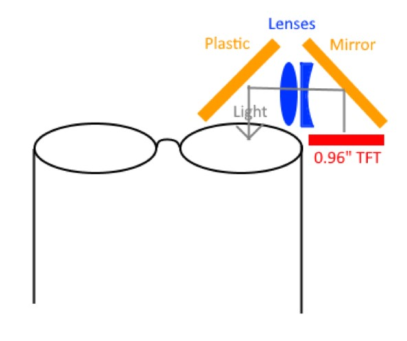
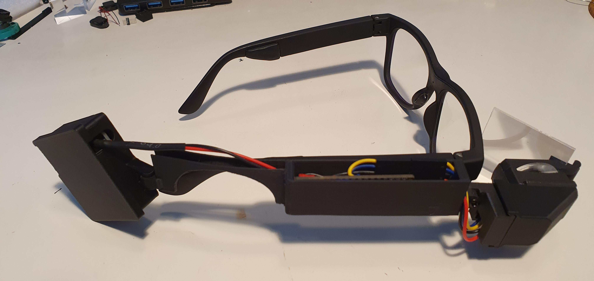
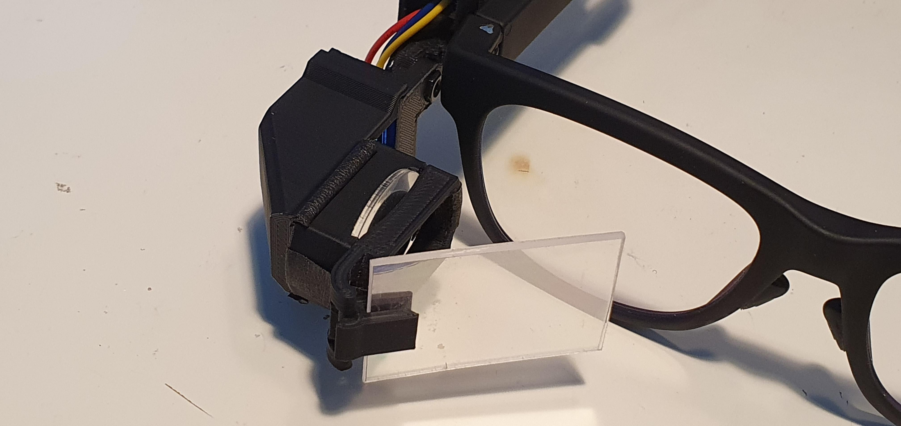
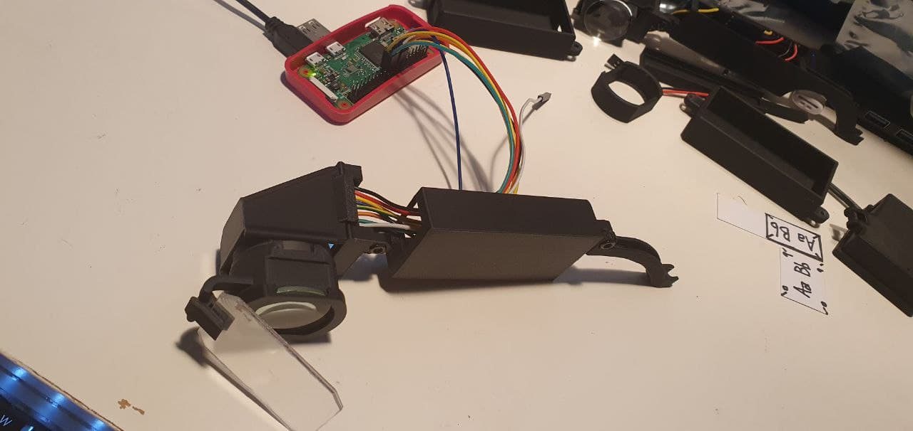
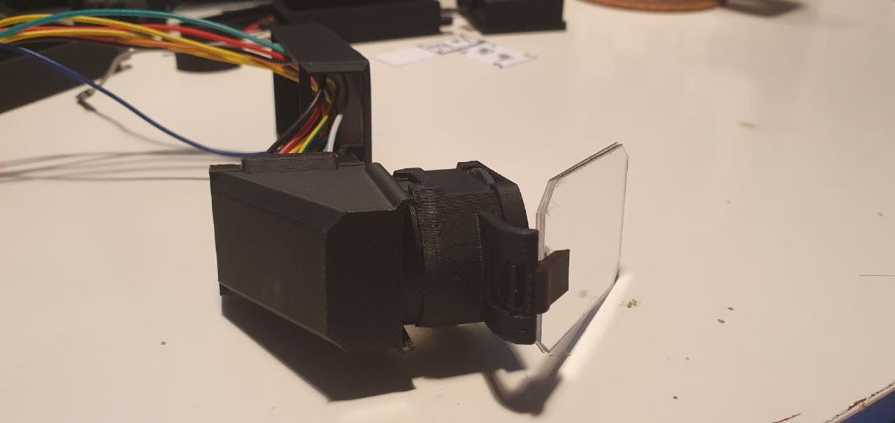
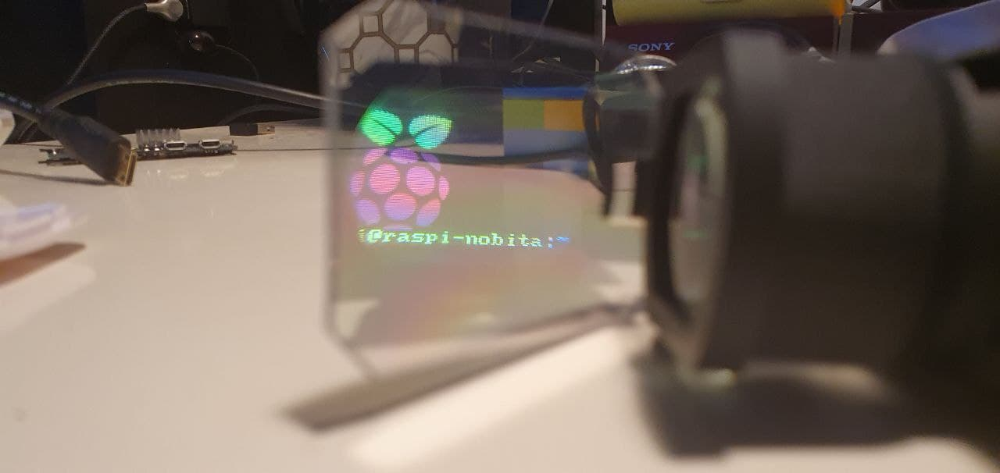

# Overview
- This is a smart glasses prototyping project to use a MCU (Arduino/ESP32) or Raspberry Pi (SBC).
- **All resources here are WIP.**

# Folders
| Folder | Description
| -- | --
| STLs | Contains the STL files for 3D printing the parts of the smart glasses prototype.
| src | Contains source code for Arduino IDE based programming (suitable for Arduinos and ESP32) and Raspberry Pi.
| design | The design files used for producing the STLs. The current software used for design is Microsoft 3D Builder.

# Basic design

# Showcase
## Initial prototype with Arduino BLE Nano
<ul>
<li>Design with Arduino BLE Nano MCU and 0.49" OLED (monochrome) screen.
  

    

    
    
    

  

</li>
<li>Code can be found in the sub-folder <code>src/arduino_ide</code></li>
</ul>

## Raspberry Pi Zero W console on the 0.96" TFT SPI display.
<ul>
<li>Displaying framebuffer of Raspbian Terminal on the display.</li>
  

    

    
    

    

    
    
    

    

    
    

  

<li>Code can be found in the folder <code>src/rpi</code></li>
</ul>