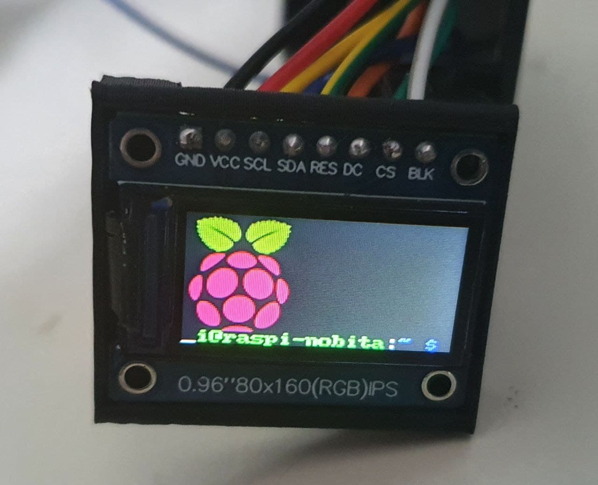
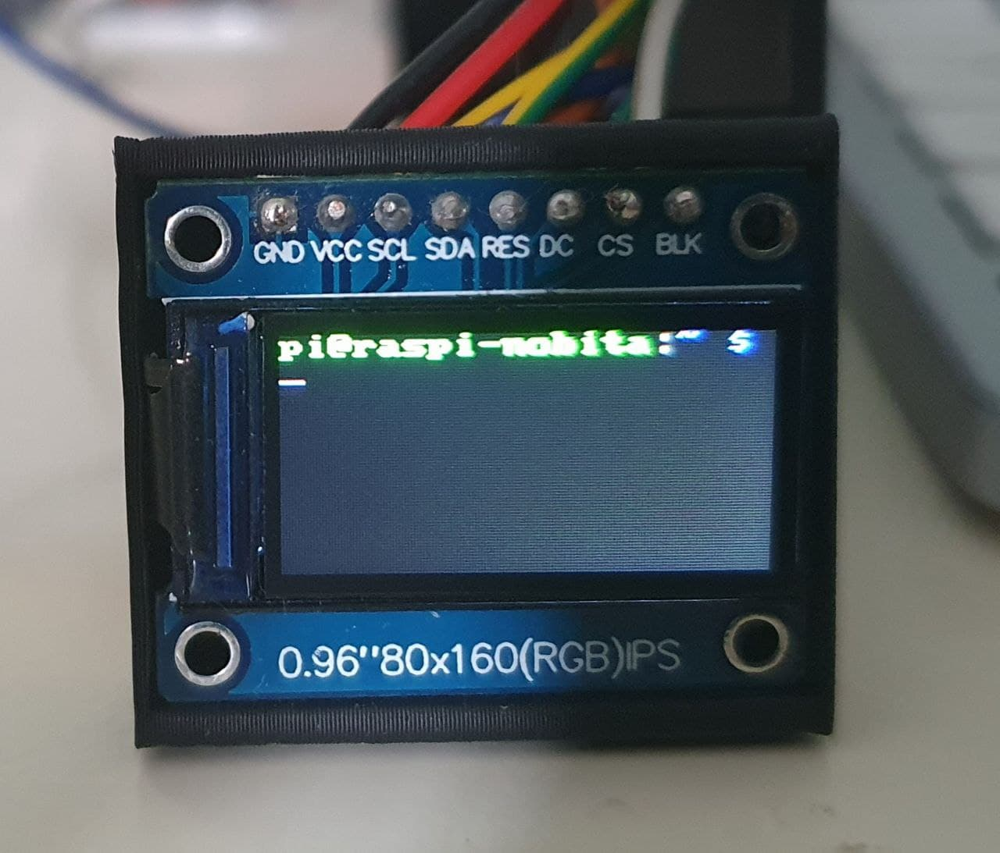

# Overview
This project contains software that mirrors your Raspberry Pi's framebuffer (where a virtual screen resides) to an ST7735S 0.96" screen (80x160 resolution).

The software is part of the effort for display the Raspberry Pi's framebuffer for the smart glasses.

Source code originated & modified from the following repositories:
- https://github.com/vinodstanur/raspberry-pi-frame-buffer-mapping-to-160x128-ST7735R-LCD
- https://github.com/bersch/ST7735S 

# Pins Assignment
*Note: We are using SPI0 channel.*
| ST7355S | Raspberry Pi Zero W
| -- | --
| VCC | 3.3v
| GND | GND
| SCL | SLCK (GPIO 11)
| SDA | MOSI (GPIO 10)
| CS | GPIO 8 (can be configured in st7735.h)
| RST | GPIO 25 (can be configured in st7735.h)
| DC | GPIO 24 (can be configured in st7735.h)

# Before you run
- If you have freshly setup your Pi, you may be booting into the GUI desktop.
- The GUI desktop is not suitable for display on such a small screen. Therefore, it would be better to start your Pi into console instead 
> Note: You can configure your Pi to start in console/terminal mode through `raspi-config` or simply the `Preferences` menu in the GUI desktop).
- Enable SPI interface from `raspi-config` or `Preferences` menu in the GUI desktop.


# How to run
- Connect the ST7735S to your Raspberry Pi as described above.
- Change the framebuffer in `/boot/config.txt` to force the framebuffer width and height to 160 x 80 (you will need root access).
```
... (other settings)
framebuffer_width=160
framebuffer_height=80
... (other settings)
```
- Change to the project folder.
- Run `make`
- Run `./run.sh`

## Auto-run script when startup
- There is a systemd service in the project folder named `st7735s.service.sample`.
- Make a copy of this file into `st7735s.service`.
- Open the file and edit the field `WorkingDirectory` to where this project folder is (where `run.sh` script resides) if necessary.
- Make sure you have root access, and copy `st7735s.service` to the folder `/etc/systemd/system`.
- Run the commands:
```
sudo systemctl enable st7735s
sudo systemctl start st7735s
```
- Verify whether the console is shown on the TFT screen.
- To test whether the script runs across reboots, type:
```
sudo reboot now
```

# Screenshots




# References
- Guide - https://learn.adafruit.com/1-8-tft-display/python-wiring-and-setup

# Improvements
- To use pixel interpolation to translate higher resolution framebuffer to 160x80 resolution.